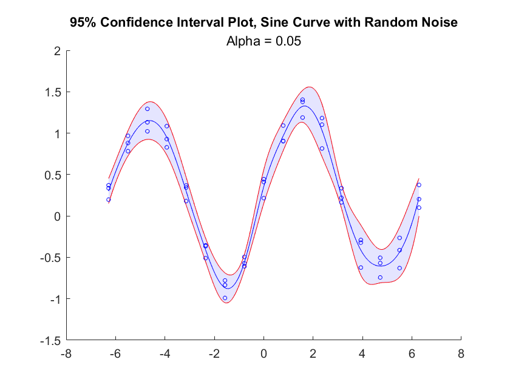

# Confidence Interval Plot

Version: 1.0

This chart creates a mean line within a shaded confidence interval area.



## Syntax
* `confidenceIntervalPlot(x,y)` create a line which passes through the means of the y-values for each unique x-value. Plot this line within a shaded area covering a 95% confidence interval for each unique x-value. x and y must be numeric vectors of equal length.
* `confidenceIntervalPlot(x,y,alpha)` create a line which passes through the means of the y-values for each unique x-value. Plot this line within a shaded area covering a 100 * (1 - alpha)% confidence interval for each unique x-value. x and y must be numeric vectors of equal length.
* `confidenceIntervalPlot()` create an empty confidence interval plot.
* `confidenceIntervalPlot(___,Name,Value)` specifies additional options for the confidence interval plot using one or more name-value pair arguments. Specify the options after all other input arguments.
* `confidenceIntervalPlot(parent,___)` creates the confidence interval plot in the specified parent.
* `h = confidenceIntervalPlot(___)` returns the confidenceIntervalPlot object. Use h to modify properties of the plot after creating it.

## Name-Value Pair Arguments/Properties
* `XData` (1 x n numeric vector) x-values of the raw data. 
* `YData` (1 x n numeric vector) y-values of the raw data.
* `CenterXData` (1 x n numeric vector) read-only property. x-values used to plot the center line. Unless the name/value pair `'edges'` is used, contains unique x-values in XData.
* `CenterYData` (1 x n numeric vector) y-values used to plot the center line. Unless the name/value pair `'edges'` is used or CenterYData is manually specified by the user, contains the mean of y-values for each unique x-value in XData.
* `CenterYDataMode` (`'auto'` or '`manual'`) mode describing the method by which the center line is determined. In `'auto'` mode, the mean of the y-values for each center line x-value used. In `'manual'` mode, the user can specify CenterYData as Name/Value pair.
* `Alpha` (scalar double) confidence level (denoted alpha) for the confidence interval about the mean line. Has lower precedence than UpperBoundData and LowerBoundData if specified. 
* `UpperBoundData` (1 x n numeric vector) upper bound data of the shaded area encapsulating the mean line. By default is set to MeanData + StdDevData unless otherwise specified.
* `LowerBoundData` (1 x n numeric vector) The lower bound data of the shaded area encapsulating the mean line. By default is set to MeanData - StdDevData unless otherwise specified.
* `BoundDataMode` (`'auto'` or '`manual'`) mode describing the method by which the bounds of the shaded area are determined. In `'auto'` mode, a confidence interval of level alpha (default `0.05`) will be used. In `'manual'` mode, the user can specify UpperBoundData and LowerBoundData as Name/Value pairs.
* `Edges` (1 x n numeric vector) edges of the bins used to group raw x-data values and generate the center line x-data and y-data. Once grouped, the mean x-value of each bin (excluding NaNs) will be used for CenterXData and the mean y-value of each bin (excluding NaNs) will be used for CenterYData. 

## Stylistic Name-Value Pair Arguments/Properties
* `TitleText` (1 x n char vector) title of the confidence interval plot.
* `SubtitleText` n x 1 char vector) subtitle of the confidence interval plot.
* `ShadeColor` (1 x 3 numeric vector) color of the shaded area surrounding the mean line.
* `ShadeAlpha` (scalar double) transparency (alpha) of the shaded area surrounding the line. 
* `CenterLineColor` (1 x 3 numeric vector) color of the center line contained in the shaded area. 
* `CenterLineWidth` (scalar double) width of the center line.
* `BorderLinesColor` (1 x 3 numeric vector) color of the two lines outlining the shaded area from above and below.
* `BorderLinesWidth` (scalar double) width of the two lines outlining the shaded area about the center line.
* `ShowRawData` (scalar `matlab.lang.OnOffSwitchState`) OnOffSwitchState object indicating whether to plot the original data (XData, YData) as scatter points.
* `RawDataMarker` (char) marker symbol for raw data if ShowRawData is true.
* `RawDataMarkerColor` (1 x 3 numeric vector) color of data markers for raw data if ShowRawData is true.
* `RawDataMarkerSize` (double) size of data markers for raw data if ShowRawData is true.
* `ShowCenterData` (scalar `matlab.lang.OnOffSwitchState`) OnOffSwitchState object indicating whether to plot the original data (CenterXData, CenterYData) as scatter points.
* `CenterDataMarker` (char) marker symbol for raw data if ShowCenterData is true.
* `CenterDataMarkerColor` (1 x 3 numeric vector) color of data markers for raw data if ShowCenterData is true.
* `CenterDataMarkerSize` (double) size of data markers for raw data if ShowCenterData is true.

## Example
Create a confidence interval plot for sine data with noise. Each unique x-value is associated with three y-values. By default, the confidence interval is a 95% confidence interval for each unique x-value.
```
uniqueX = -2 * pi : pi/4 : 2*pi;

x = repelem(uniqueX, 3);
y = sin(x) + 0.5 * rand(size(x));
 
cip = confidenceIntervalPlot(x,y);
cip.NumSteps = 10;

title("95% Confidence Interval Plot, Sine Curve with Random Noise");
subtitle("Alpha = 0.05");
```
